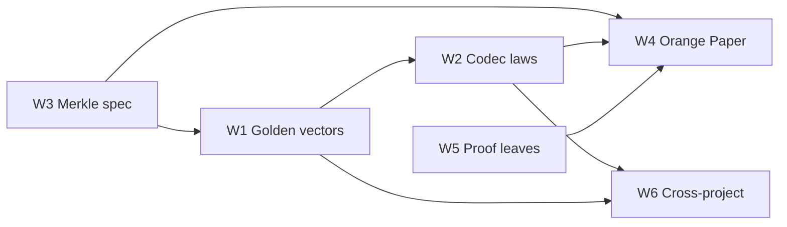

# Byte-layer verification plan (btc-verified lessons)

**Status:** Not started — tracker for methodology adopted from [btc-verified](https://github.com/ProofOfKeags/btc-verified).  
**Last revised:** 2026-07-07  
**Related:** [BLVM vs btc-verified comparison](./BTC_VERIFIED_COMPARISON.md) · local reference checkout at `../../btc-verified`  
**Primary crates:** `blvm-primitives`, `blvm-consensus`, `blvm-spec`, `blvm-spec-lock`

---

## 1. Problem statement

BLVM’s correctness story is strong at the **node and consensus** layers (Orange Paper, spec-lock, differential testing against Bitcoin Core). It is weaker at the **byte layer** — the foundation every higher layer assumes:

| Gap | Risk |
|-----|------|
| Serialization tests check **round-trip** but not **canonicality** | Non-canonical wire encodings may parse when they should not |
| Golden vectors are sparse and do not **re-encode byte-for-byte** | Model can drift from Bitcoin wire format without failing CI |
| Merkle logic is correct but **spec/impl story is fused** in imperative code | CVE-2012-2459 defenses are hard to audit; discriminating cases under-tested |
| Binding properties (txid, block hash, merkle root) **assume collision resistance informally** | Spec and spec-lock overstate what cryptography proves |
| Script **wire vs execution** boundary is implicit in code | Orange Paper readers may assume tokenization at deserialize |
| Spec-lock coverage is a **flat function list**, not reviewable **proof leaves** | Verification progress is hard to audit incrementally |

[btc-verified](https://github.com/ProofOfKeags/btc-verified) addresses these with Lean 4 proof leaves. This plan imports the **methodology** into Rust + Orange Paper + spec-lock — **not** a Lean rewrite or dependency.

---

## 2. Goals and non-goals

### Goals

1. **Composable serialization laws** — round-trip + canonicality, tested per primitive and inherited by composition.
2. **Golden-vector CI gate** — real mainnet bytes decode, spot-check, re-encode **byte-for-byte** (shared fixture set with btc-verified where possible).
3. **Documented merkle model** — tree spec, canonicality rule, Core-equivalent vector impl, discriminating test vectors.
4. **Honest binding vocabulary** — collision disjunct in Orange Paper and spec-lock contracts.
5. **Proof-leaf workflow** — small, named verification increments with explicit checked claims.
6. **Cross-project fixture agreement** — same hex in btc-verified `Tests/GoldenVectors.lean` and BLVM `golden_vectors` tests.

### Non-goals

- Replacing Rust consensus with Lean-extracted code
- Making Lean a build dependency of BLVM crates
- Full `Tx { Legacy | Segwit }` enum refactor in the first phase (tracked as later workstream)
- CI-gated full-chain differential (existing operator-driven program unchanged)

---

## 3. Workstreams overview



| ID | Workstream | Primary repo | Phase | Effort |
|----|------------|--------------|-------|--------|
| **W1** | Golden-vector test harness | `blvm-primitives` | 1 | Small |
| **W2** | Codec discipline (laws + property tests) | `blvm-primitives` | 1–2 | Medium |
| **W3** | Merkle spec / impl / vectors | `blvm-consensus` | 2 | Medium |
| **W4** | Orange Paper amendments | `blvm-spec` | 2–3 | Small–medium |
| **W5** | Proof-leaf process + coverage layout | `blvm-spec-lock`, `blvm-consensus` | 2–3 | Small |
| **W6** | Cross-project fixture sync | `blvm-primitives`, `btc-verified` | 3 | Small |

**Phase 1** (ship first): W1 — immediate CI value, unblocks W6.  
**Phase 2**: W2 + W3 — structural correctness.  
**Phase 3**: W4 + W5 + W6 — spec prose, process, external alignment.

---

## 4. W1 — Golden-vector test harness

### 4.1 Deliverables

| Item | Location |
|------|----------|
| Integration test module | `blvm-primitives/tests/golden_vectors.rs` |
| Shared hex constants | `blvm-primitives/tests/fixtures/golden_vectors.toml` or `golden_vectors.json` |
| Optional large block fixture | `blvm-primitives/tests/fixtures/.gitignore` + fetch script |
| CI wiring | `blvm-primitives/.github/workflows/ci.yml` or org `rust-ci` template |

### 4.2 Fixture set (align with btc-verified)

| Fixture | Source in btc-verified | BLVM assertions |
|---------|------------------------|-----------------|
| First Bitcoin payment (legacy tx) | `firstBitcoinPaymentHex` | `!segwit`; txid `f4184fc5…`; decode → re-encode `==` input; prevout block-9 coinbase |
| SegWit activation coinbase | `segwitCoinbaseHex` | SegWit form; witness reserved value 32 zeros; 2 outputs |
| First SegWit spend | `firstSegwitSpendHex` | P2SH-wrapped P2WPKH; 2-item witness |
| Genesis block | genesis hex in `GoldenVectors.lean` | Header 80 bytes; coinbase txid = merkle root; full block re-encode |
| Block 170 | block 170 hex | Embedded payment re-encodes to standalone first-payment vector |
| Genesis → block 1 chain | block 1 header hex | Header hash; `prevBlockHash` links genesis |
| Block 481824 (full) | `Tests/BlockFixtures.lean` / `lake test` | All txs round-trip; coinbase + first SegWit spend match standalone vectors; merkle + header hash |

**Rule (from btc-verified):** for every vector, `deserialize(bytes)` must consume **all** bytes and `serialize(decoded) == bytes`.

### 4.3 Large fixture handling

Block 481824 (~989 KB) should **not** be committed. Mirror btc-verified:

```
blvm-primitives/tests/fixtures/
├── golden_vectors.toml          # inline hex for small vectors
├── fetch_block_fixture.sh       # curl block by hash, cache locally
└── .gitignore                   # 481824.raw, *.cache
```

CI: `cargo test golden_vectors` runs small vectors always; block 481824 test runs when cache present or on scheduled/nightly job that fetches once.

### 4.4 Acceptance criteria

- [ ] `cargo test -p blvm-primitives golden_vectors` passes on clean checkout (small vectors only)
- [ ] At least 5 inline fixtures match btc-verified hex literals byte-for-byte
- [ ] Failure message names fixture id and first diverging byte offset
- [ ] Documented in `blvm-primitives/tests/README.md` (or module doc comment)

---

## 5. W2 — Codec discipline

### 5.1 Deliverables

| Item | Location |
|------|----------|
| `Codec` trait + law helpers | `blvm-primitives/src/serialization/codec.rs` |
| Law test macros or fns | `blvm-primitives/src/serialization/codec.rs` (`#[cfg(test)]`) |
| Proptest generators | `blvm-primitives/tests/codec_properties.rs` |
| Re-exports | `blvm-primitives/src/serialization/mod.rs` |

### 5.2 Trait sketch

```rust
/// Serialization primitive satisfying Bitcoin wire laws.
pub trait Codec: Sized {
    fn encode(&self) -> Vec<u8>;
    /// Returns `(value, bytes_consumed)`; errors if prefix invalid.
    fn decode_prefix(data: &[u8]) -> Result<(Self, usize)>;

    fn round_trip_laws(&self) -> Result<()> { /* encode then decode_prefix */ }
    fn canonical_law(bytes: &[u8]) -> Result<()> { /* full consume + re-encode */ }
}
```

Implement incrementally:

| Order | Type / module | Existing code |
|-------|---------------|---------------|
| 1 | `u64` CompactSize / varint | `serialization/varint.rs` |
| 2 | Fixed-width LE (`u8`…`u64`, `Hash`) | scattered in transaction/block |
| 3 | `CountedList<T>` wrapper | newtype over `Vec<T>` with count prefix |
| 4 | `OutPoint`, `TxIn`, `TxOut`, `TxBody` | `serialization/transaction.rs` |
| 5 | Full `Transaction` (legacy + SegWit dispatch) | same |
| 6 | `BlockHeader`, `Block` | `serialization/block.rs` |

### 5.3 Canonicality tests (beyond round-trip)

Add explicit rejection cases:

- Varint: value `0` encoded as `0xfd 0x00 0x00` must **fail** decode
- Varint: value `0xfc` as single byte `0xfc` must **fail** (must use `0xfd` prefix)
- Transaction: legacy path with zero input count where SegWit marker would apply
- Trailing garbage: `decode(tx_bytes ++ [0xff])` must not succeed as canonical full consume (unless API is explicitly prefix-consuming — document which APIs are strict)

### 5.4 spec-lock (optional phase 2b)

Annotate varint encode/decode with `#[spec_locked]` pointing to Orange Paper serialization section once W4 lands. Z3 obligations: round-trip and canonicality for bounded values.

### 5.5 Acceptance criteria

- [ ] `Codec` trait documented with the two laws (round-trip, canonicality)
- [ ] Property tests pass for varint and at least one composite type (`TxIn` or `TxBody`)
- [ ] At least 3 canonicality **rejection** tests per primitive
- [ ] Golden vectors (W1) use `canonical_law` helper — single code path

---

## 6. W3 — Merkle spec, implementation, and vectors

### 6.1 Deliverables

| Item | Location |
|------|----------|
| Merkle design doc | `blvm-consensus/docs/MERKLE.md` |
| Pure spec function (test/reference) | `blvm-consensus/src/merkle_spec.rs` (or `mining/merkle_tree.rs`) |
| Discriminating test module | `blvm-consensus/tests/merkle_discriminating_vectors.rs` |
| Extend existing | `blvm-consensus/tests/merkle_mutation_detection.rs` |

### 6.2 Document (MERKLE.md) must cover

1. **Tree model** — top-down bisection, explicit `pad` for odd levels (btc-verified `BtcVerified.Merkle`)
2. **Canonicality predicate** — what leaf lists threaten binding (CVE-2012-2459 right-spine case)
3. **Vector implementation** — bottom-up fold in `mining.rs::calculate_merkle_root`
4. **Core fidelity** — scan adjacent duplicates **before** padding each level (ordering from btc-verified `Impl.BitcoinCore`)
5. **Known residual** — 64-byte tx leaf/interior ambiguity (Great Consensus Cleanup); why block validity has tx count in hand
6. **Collision disjunct** — equal roots + Core-accepted ⇒ equal leaf list **or** SHA-256 collision witness

### 6.3 Discriminating vectors (from btc-verified)

| Input (tx id bytes) | `mutated` / reject | Notes |
|---------------------|-------------------|-------|
| `[1, 2, 3, 3]` | mutated | CVE attack shape |
| `[1, 2, 3]` | accept | distinct leaves |
| `[1, 2, 2]` | accept (not mutated) | scan-before-pad discriminator |
| `[7, 7]` | mutated | canonical yet duplicates — Core strictly stronger than canonicality alone |

Test `calculate_merkle_root_from_tx_ids` (or hash list API) against these.

### 6.4 Spec vs production path

- Keep optimized `calculate_merkle_root` in `mining.rs` for production
- Add `merkle_root_spec(hashes: &[Hash]) -> Result<Hash>` — readable reference
- Property test: `spec(hashes) == production(hashes)` for all discriminating vectors + random small lists

### 6.5 Acceptance criteria

- [ ] `MERKLE.md` reviewed and linked from `blvm-consensus/README.md`
- [ ] All four discriminating vectors tested
- [ ] Block 481824 merkle root matches header when fixture available (ties to W1)
- [ ] `merkle_mutation_detection.rs` references MERKLE.md and CVE section

---

## 7. W4 — Orange Paper amendments

### 7.1 Deliverables

| Section | Repo / file | Change |
|---------|-------------|--------|
| Serialization canonicality | `blvm-spec/PROTOCOL.md` §3.x (new or extend) | CompactSize shortest encoding; decode must reject non-canonical |
| `CountedList` / prefixed vectors | same | Count prefix + elements; composition rule |
| Script wire boundary | `blvm-spec/PROTOCOL.md` §3.3 / §5.2 | Deserialize accepts raw bytes; tokenization only at execution; coinbase scriptSigs may not tokenize |
| Legacy tx non-empty `vin` | same | SegWit `0x00` marker disambiguation |
| Binding / collision vocabulary | `blvm-spec/ARCHITECTURE.md` or consensus appendix | txid, block hash, merkle root binding stated as disjunct |
| Merkle canonicality | cross-link | Point to `blvm-consensus/docs/MERKLE.md` |

### 7.2 spec-lock drift

After prose lands, run `cargo spec-lock check-drift` in `blvm-consensus` and update `#[spec_locked]` section references for touched serialization functions.

### 7.3 Book mirror

Add task to [`docs/BLVM_DOCS_UPDATE_PLAN.md`](../../docs/BLVM_DOCS_UPDATE_PLAN.md) or `blvm-docs` backlog: formal verification chapter links to canonicality + collision disjunct.

### 7.4 Acceptance criteria

- [ ] Orange Paper PR with review from consensus maintainers
- [ ] `check-drift` clean after annotation updates
- [ ] No contradiction with btc-verified's stated wire facts (CountedList, script raw, legacy non-empty vin)

---

## 8. W5 — Proof-leaf workflow

### 8.1 Deliverables

| Item | Location |
|------|----------|
| GitHub issue template | `blvm-consensus/.github/ISSUE_TEMPLATE/proof_leaf.yml` (and/or org `.github`) |
| Coverage doc restructure | `blvm-spec-lock/SPEC_LOCK_COVERAGE.md` — group by leaf |
| Contributor guide section | `blvm-consensus/CONTRIBUTING.md` or `docs/VERIFICATION.md` |

### 8.2 Proof leaf definition

A **proof leaf** is a mergeable unit that includes:

1. **Scope** — one logical concern (e.g. "CompactSize canonicality", "merkle Core scan")
2. **Orange Paper §** — numbered reference
3. **Checked claims** — bullet list naming theorems/tests (mirroring btc-verified module headers)
4. **Artifacts** — spec-lock annotations, property tests, golden vectors (if wire)
5. **Drift** — `check-drift` pass for affected sections

### 8.3 Issue template fields

- Leaf title
- Orange Paper section(s)
- Checked claims (copy-paste checklist)
- Golden vector required? (yes/no)
- Crates touched
- Depends on leaf #…

### 8.4 Restructure SPEC_LOCK_COVERAGE.md

Organize by leaf, not alphabetically by function:

```markdown
## Leaf: CompactSize (blvm-primitives)
- Claims: round-trip, canonicality, max length 9
- Functions: encode_varint, decode_varint
- Tests: codec_properties, golden_vectors (if any)
- Status: partial | complete
```

### 8.5 Acceptance criteria

- [ ] Issue template live in `blvm-consensus`
- [ ] At least 3 existing spec-lock areas retroactively documented as leaves (merkle, varint, connect_block)
- [ ] CONTRIBUTING.md links proof-leaf process

---

## 9. W6 — Cross-project fixture sync

### 9.1 Deliverables

| Item | Location |
|------|----------|
| Fixture manifest | `blvm-primitives/tests/fixtures/MANIFEST.json` — id, txid/block hash, btc-verified theorem reference |
| Optional upstream PR | `btc-verified` — link to BLVM manifest in README (informational) |
| Scheduled check | CI job or manual doc: compare hex literals between repos on release |

### 9.2 Sync procedure

1. When btc-verified adds a golden vector, open BLVM issue citing `Tests/GoldenVectors.lean` line range
2. Copy hex literal into `golden_vectors.toml` with matching `id` field
3. Run both test suites locally before merge
4. On intentional divergence, document **why** in MANIFEST.json `note` field

### 9.3 Acceptance criteria

- [ ] MANIFEST.json lists all W1 fixtures with btc-verified cross-reference
- [ ] Process documented in this plan §9.2 and `blvm-primitives/tests/README.md`
- [ ] One successful manual sync demonstrated (first payment vector)

---

## 10. Future workstream (out of phase 1–3)

### W7 — Era-aware transaction types (breaking change)

Evaluate `enum Tx { Legacy(TxBody), Segwit { … } }` in `blvm-primitives` per btc-verified model:

- Non-empty legacy inputs as type-level proof
- Per-input witness bundling
- Migration path for `blvm-consensus` / `blvm-protocol` re-exports

**Gate:** W1 + W2 complete; major version bump across release set.

---

## 11. Implementation order (checklist)

### Phase 1 — Quick wins

- [ ] **W1.1** Create `blvm-primitives/tests/golden_vectors.rs` with first payment + genesis + segwit coinbase hex from btc-verified
- [ ] **W1.2** Add `checks_out(bytes)` helper: full consume + re-encode equality
- [ ] **W1.3** Wire into `blvm-primitives` CI
- [ ] **W1.4** Add block 170 vector + embedded-payment sub-vector check

### Phase 2 — Structural

- [ ] **W2.1** `Codec` trait + varint impl + property tests
- [ ] **W2.2** Canonicality rejection tests for varint
- [ ] **W2.3** Extend to `Transaction` / `BlockHeader` composition tests
- [ ] **W3.1** Write `blvm-consensus/docs/MERKLE.md`
- [ ] **W3.2** Add discriminating merkle vector tests
- [ ] **W3.3** Optional `merkle_root_spec` equivalence test

### Phase 3 — Spec and process

- [ ] **W4.1** Orange Paper canonicality + script wire boundary PR
- [ ] **W4.2** Collision disjunct appendix
- [ ] **W5.1** Proof-leaf issue template
- [ ] **W5.2** Restructure SPEC_LOCK_COVERAGE.md by leaf
- [ ] **W6.1** MANIFEST.json + sync procedure doc
- [ ] **W1.5** Block 481824 fetch script + nightly test job

---

## 12. Ownership and review

| Workstream | Suggested owner crate | Review focus |
|------------|----------------------|--------------|
| W1, W2, W6 | `blvm-primitives` | Wire format, btc-verified alignment |
| W3 | `blvm-consensus` | CVE-2012-2459, Core parity |
| W4 | `blvm-spec` | Orange Paper accuracy |
| W5 | `blvm-spec-lock` + `blvm-consensus` | CI policy, coverage honesty |

Consensus-critical changes (W1 golden failures, W3 merkle behavior) require **consensus-tier** review per org governance.

---

## 13. Success metrics

| Metric | Target |
|--------|--------|
| Golden vectors in CI | ≥ 6 inline fixtures passing on every PR |
| Canonicality tests | ≥ 1 per serialization primitive in W2 scope |
| Merkle discriminating vectors | 4/4 passing |
| Orange Paper gaps closed | W4 checklist complete |
| Proof leaves documented | ≥ 10 leaves in SPEC_LOCK_COVERAGE.md |
| btc-verified hex alignment | 100% for fixtures in MANIFEST.json |

---

## 14. References

- [BLVM vs btc-verified comparison](./BTC_VERIFIED_COMPARISON.md)
- [btc-verified README](https://github.com/ProofOfKeags/btc-verified/blob/master/README.md) — proof leaf catalog
- [btc-verified CLAUDE.md](../../btc-verified/CLAUDE.md) — codec discipline
- [btc-verified Tests/GoldenVectors.lean](../../btc-verified/Tests/GoldenVectors.lean) — hex literals
- [BLVM formal verification (book)](https://docs.thebitcoincommons.org/consensus/formal-verification.html)
- [blvm-consensus PROOF_LIMITATIONS.md](https://github.com/BTCDecoded/blvm-consensus/blob/main/docs/PROOF_LIMITATIONS.md)

---

*Update the **Status** line at the top when phases land. Check off §11 items as work completes.*
