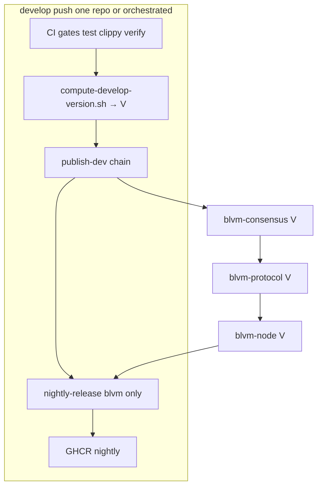

# Develop channel plan (binaries + crates.io)

**Status:** **Implemented in tree** (2026-05-19). Requires `develop` on GitHub + `CARGO_REGISTRY_TOKEN` before first live publish/nightly.  
**Repos:** [BTCDecoded/blvm](https://github.com/BTCDecoded/blvm) and coordinated siblings  
**Stable reference:** `blvm/versions.toml`, `blvm/docs/RELEASE_PROCESS.md`, per-repo `release` jobs in `*/.github/workflows/ci.yml`

Umbrella plan for **`develop`**. Binary-only notes: [DEVELOP_NIGHTLY_RELEASE_PLAN.md](DEVELOP_NIGHTLY_RELEASE_PLAN.md).

---

## Goals

| Channel | Branch | crates.io | GitHub Release | GHCR | Consumers |
|---------|--------|-----------|----------------|------|-----------|
| **Stable** | `main` | Official `0.1.N` | New `v0.1.N` | `:version`, `:latest` | Production |
| **Develop** | `develop` | `0.1.(N+1)-dev.M` | Rolling **`nightly`** prerelease | **`:nightly` only** | Integrators, nightly binaries |

**Principles (locked):**

- **`main` unchanged** for stable release/publish.
- **crates.io only** for first-party libs (no git-deps channel).
- **Committed `develop` `Cargo.toml`:** sibling deps stay `>=0.1, <1`; CI rewrites before test/build/publish.
- **No manual** realignment when stable advances — resolver + version scheme handle it.
- **Binary names** match stable (`version=nightly`); only GitHub **tag** is `nightly`.

---

## Plan validation (against current repo)

### Confirmed sound

| Claim | Evidence |
|-------|----------|
| Stable release only on `main` | `blvm-consensus` `release` job: `github.ref == 'refs/heads/main'` (~line 727) |
| `develop` runs CI but not stable release | `on.push.branches: [main, develop]`; release gated to main |
| PR → `develop` runs same gates as PR → `main` | `pull_request.branches: [main, develop]` on release-set `ci.yml` |
| Sibling deps use `>=0.1, <1` | `blvm/Cargo.toml`, `blvm-protocol/Cargo.toml`, `blvm-node/Cargo.toml` |
| Strip patches before registry build | `BTCDecoded/rust-ci/strip-patch-crates-io@main` in all release paths |
| Publish order protocol → consensus | `blvm-protocol` `release`: `cargo search blvm-consensus` then sed before publish |
| `blvm` nightly jobs exist | `blvm/.github/workflows/ci.yml`: `nightly-release`, `docker-ghcr-nightly` |
| Semver dev ahead of stable uses patch+1 | Required so `patch(D) > patch(S)` resolver works |

### Gaps / deltas vs today (must implement)

| Gap | Current state | Plan requirement |
|-----|---------------|------------------|
| ~~**Nightly binary ≠ dev crates**~~ | — | **Done:** `publish-develop-set` → `resolve --publish V` → `nightly-release` |
| **Stable versions not always lockstep** | Each repo `Determine version` bumps **its own** next patch; protocol pins **latest** consensus from `cargo search`, not necessarily same patch | Develop uses **one `V`** for entire set (stricter than today’s stable) |
| **`develop` branch missing on GitHub** | `origin` has no `develop` yet | Create before first nightly/publish run (see Addendum A) |
| **PRs targeting `develop` did not run CI** | `pull_request.branches` was `[main]` only on release-set repos | **Fixed in tree:** `[main, develop]` on coordinated `ci.yml` (2026-05-19) |
| ~~**No shared resolver scripts**~~ | — | **`blvm/scripts/`** — `compute-develop-version.sh`, `resolve-develop-registry-deps.py`, `ci-publish-develop.sh`, … |
| ~~**Test on develop without resolver**~~ | — | **`resolve` mode** in `blvm` `test` job on `develop` / PR → `develop` |
| ~~**`publish-dev` not implemented**~~ | — | **`publish-dev`** on consensus/protocol/node; **`publish-develop-set`** on `blvm` |

### Risks and mitigations

| Risk | Mitigation |
|------|------------|
| Partial publish chain (protocol fails after consensus) | Fail job; do not bump `M` on crates.io for partial set; next run recomputes same `V` if unpublished |
| `sed` breaks `{ version = "...", features = [...] }` | Use `resolve-develop-registry-deps.py` (toml-aware) or awk scoped by crate name |
| Develop `Cargo.toml` version commits pollute branch | **Do not push** version-bump commits on develop; publish with `--allow-dirty` (already used in `blvm-protocol` release) |
| crates.io index lag | Keep 30s wait after each publish; `cargo search` / API retry in downstream job |
| `blvm-primitives` not in dev set | Leave `>=0.1, <1` unchanged (non-sibling); only rewrite **release-set** crates |

**Verdict:** Plan is **implemented** in the workspace tree. First live run needs **`develop`** branches on GitHub and registry tokens.

---

## Architecture



**Recommended job order on `blvm` (develop):**

```text
setup → build-dev → test* → clippy → fmt → docs → security → build
  → publish-develop-set (or wait for sibling dispatches)
  → nightly-release
  → docker-ghcr-nightly
```

\* `test` on develop: insert **Resolve develop registry deps** after `strip-patch` when running crates.io-only verification (optional Phase 2b).

---

## Part A — Binary nightly (GitHub + GHCR)

### Implemented today

| Piece | Location |
|-------|----------|
| Jobs | `blvm/.github/workflows/ci.yml` — `nightly-release`, `docker-ghcr-nightly` |
| Script | `blvm/scripts/ci-nightly-artifacts.sh` |

### Implemented

- [x] `nightly-release.needs` → **`publish-develop-set`**
- [x] Before `cargo build`: `resolve-develop-registry-deps.sh --mode publish --version "$V"`
- [x] `cargo tree -p blvm-node` sanity check step

### Consumer URLs

```bash
curl -LO https://github.com/BTCDecoded/blvm/releases/download/nightly/blvm-nightly-linux-x86_64
docker pull ghcr.io/btcdecoded/blvm:nightly
```

---

## Part B — crates.io develop pre-releases

### Version scheme (normative)

**Inputs:** crates.io API `GET https://crates.io/api/v1/crates/{crate}/versions`

**Definitions (for release-set anchor crate `blvm-consensus`, or max across set):**

1. **`S`** = max stable version matching `^[0-9]+\.[0-9]+\.[0-9]+$` (no `-`).
2. **`DEV_PREFIX`** = `0.1.{patch(S)+1}-dev` (e.g. `S=0.1.42` → `0.1.43-dev`).
3. **`M`** = `1 + max(N)` where existing versions match `^0\.1\.{patch(S)+1}-dev\.([0-9]+)$`.
4. **`V`** = `{DEV_PREFIX}.{M}` (e.g. `0.1.43-dev.8`).

**Coordinate:** One **`V`** per pipeline run for **all** crates in the release set (consensus, protocol, node, sdk, …).

**Do not** derive `V` per crate independently (differs from today’s stable behavior).

### `compute-develop-version.sh` (spec)

**Path:** `blvm/scripts/compute-develop-version.sh`

**Usage:**

```bash
# Default anchor: blvm-consensus
./scripts/compute-develop-version.sh
# stdout: 0.1.43-dev.8
# stderr: human log

# Optional: verify all release-set crates agree on stable S within patch
./scripts/compute-develop-version.sh --anchor blvm-consensus --verify-set
```

**Algorithm (bash + jq):**

```bash
fetch_versions() {
  curl -sf -H "User-Agent: blvm-ci/1.0" \
    "https://crates.io/api/v1/crates/$1/versions" | jq -r '.versions[].num'
}

S=$(fetch_versions blvm-consensus | grep -E '^[0-9]+\.[0-9]+\.[0-9]+$' | sort -V | tail -1)
MAJOR=$(echo "$S" | cut -d. -f1)
MINOR=$(echo "$S" | cut -d. -f2)
SPATCH=$(echo "$S" | cut -d. -f3)
NPATCH=$((SPATCH + 1))
PREFIX="${MAJOR}.${MINOR}.${NPATCH}-dev"
MAX_M=$(fetch_versions blvm-consensus | grep -E "^${PREFIX}\.[0-9]+$" \
  | sed -E "s/^${PREFIX}\.//" | sort -n | tail -1)
M=$(( ${MAX_M:-0} + 1 ))
echo "${PREFIX}.${M}"
```

**Outputs for CI:**

```bash
echo "version=${V}" >> "$GITHUB_OUTPUT"
echo "dev_prefix=${PREFIX}" >> "$GITHUB_OUTPUT"
echo "based_on_stable=${S}" >> "$GITHUB_OUTPUT"
```

**Edge cases:**

| Case | Behavior |
|------|----------|
| No stable on crates.io yet | Fail or fall back to `versions.toml` `[versions].blvm-consensus.version` |
| `S` has multiple minors | Stay on `0.1` line (`MAJOR.MINOR` from `S`) until policy changes |
| `V` already exists (re-run) | Increment `M` until free (same loop as stable release) |

### Publish order and per-crate steps

**Release set (phase 2 minimum):**

| Order | Crate | Sibling deps to pin (`=V`) |
|-------|-------|---------------------------|
| 1 | `blvm-consensus` | (none in set; keep `blvm-primitives`, `blvm-spec-lock` as `>=0.1, <1`) |
| 2 | `blvm-protocol` | `blvm-consensus` |
| 3 | `blvm-node` | `blvm-protocol`, `blvm-consensus` |
| 4 | `blvm-sdk` | protocol/consensus as per its `Cargo.toml` |
| 5 | `blvm` (optional crate publish) | `blvm-node`, optional `blvm-sdk` |

**Per-crate `publish-dev` job template** (mirror stable `release`, change `if` + version steps):

```yaml
publish-dev:
  name: Publish develop (crates.io pre-release)
  needs: [build, test, verify, ...]   # same gates as stable release
  if: |
    github.event_name == 'push' &&
    github.ref == 'refs/heads/develop' &&
    ... skip_release / skip ci ...   # never on pull_request
  env:
    CARGO_REGISTRY_TOKEN: ${{ secrets.CARGO_REGISTRY_TOKEN }}
  outputs:
    version: ${{ steps.dev_version.outputs.version }}
  steps:
    - uses: actions/checkout@v4
    - uses: BTCDecoded/rust-ci/strip-patch-crates-io@main
    # ... consensus-setup, rust, spec-lock setup same as stable ...

    - name: Compute develop version V
      id: dev_version
      run: |
        V=$(bash /path/to/compute-develop-version.sh)  # or checkout blvm/scripts
        echo "version=${V}" >> "$GITHUB_OUTPUT"

    - name: Set package version for publish
      run: |
        V="${{ steps.dev_version.outputs.version }}"
        awk -v ver="$V" '...' Cargo.toml > tmp && mv tmp Cargo.toml

    - name: Pin sibling crates to V
      run: |
        V="${{ steps.dev_version.outputs.version }}"
        bash scripts/resolve-develop-registry-deps.sh --mode publish --version "$V" Cargo.toml

    - name: cargo publish --dry-run
      run: cargo publish --dry-run --allow-dirty

    - name: cargo publish
      run: cargo publish --token "$CARGO_REGISTRY_TOKEN" --allow-dirty

    - name: Wait for crates.io index
      run: sleep 30
```

**Do not** mirror stable’s “commit Cargo.toml bump to develop” unless you want permanent `version = "0.1.43-dev.8"` on branch — **recommended: no commit**, `--allow-dirty` only.

### Multi-repo orchestration (choose one)

**Option A — Monorepo checkout on runner (simplest for local workspace)**

Single workflow in `blvm` (or dedicated `develop-release.yml`) with sibling dirs present (self-hosted runner often has them):

```text
1. compute V once
2. publish blvm-consensus (checkout consensus, run template)
3. publish blvm-protocol
4. publish blvm-node
5. blvm nightly-release with V
```

**Option B — `repository_dispatch` chain (matches production multi-repo)**

```text
blvm-consensus publish-dev → dispatch protocol
protocol publish-dev → dispatch node  
node publish-dev → dispatch blvm
payload: { "version": "0.1.43-dev.8" }
```

`blvm` already listens for `build-chain`, `upstream-changed` on push; extend payload with `develop_version`.

**Option C — Manual `workflow_dispatch` with input `V`**

For recovery when chain breaks.

**Phase 2 recommendation:** Option A if runner has siblings; else Option B.

---

## Part C — Dependency resolver

### `resolve-develop-registry-deps` (spec)

**Path:** `blvm/scripts/resolve-develop-registry-deps.py` (preferred over sed)  
**Shell wrapper:** `resolve-develop-registry-deps.sh` → invokes python3

**CLI:**

```text
resolve-develop-registry-deps.py [--mode resolve|publish] [--version V] Cargo.toml [more.toml ...]

Modes:
  publish  Require --version V; set every listed sibling dep to version = "=V"
           (preserve features, default-features, optional).

  resolve  For each sibling dep line matching >=0.1, <1:
             - Fetch S, D from crates.io for that crate name
             - If patch(D) > patch(S): set "=D" (latest dev on index)
             - Else: leave line unchanged
```

**Sibling list** (from `versions.toml` `[versions]`):

```python
RELEASE_SET_SIBLINGS = [
    "blvm-consensus",
    "blvm-protocol",
    "blvm-node",
    "blvm-sdk",
]
# governance-app / blvm-commons: add when published to crates.io in this pipeline
```

**Lines to rewrite** (examples from real manifests):

```toml
blvm-consensus = { version = ">=0.1, <1" }
blvm-consensus = { version = ">=0.1, <1", optional = true }
blvm-protocol = { version = ">=0.1, <1", features = ["production"] }
blvm-node = { version = ">=0.1, <1", default-features = false }
```

**Do not rewrite:**

```toml
blvm-consensus = { path = "../blvm-consensus" }   # [patch] / dev-deps
blvm-primitives = { version = ">=0.1, <1" }    # not a sibling in set
blvm-spec-lock = { version = ">=0.1, <1" }      # tooling; separate publish order
```

**Implementation sketch (toml / regex):**

- Parse with `tomllib` (Py 3.11+) or careful line-based rewriter.
- Only touch `dependencies` / `dev-dependencies` tables (not `[features]` keys named `blvm-node/...`).
- Emit unified form: `blvm-consensus = { version = "=0.1.43-dev.8" }` (drop range for publish mode).

**Patch-ahead helper:**

```python
def patch_num(ver: str) -> int:
    # "0.1.43-dev.8" -> 43 ; "0.1.42" -> 42
    core = ver.split("-")[0]
    return int(core.split(".")[2])

use_dev = patch_num(D) > patch_num(S)
```

### Where to call resolver

| Repo | Job | When |
|------|-----|------|
| `blvm-consensus` | `test`, `build` | After `strip-patch`, before `cargo test` / `cargo build` — **only if** `CARGO_REGISTRY_TOKEN` set and develop publishes exist |
| `blvm-protocol` | same | same |
| `blvm-node` | same | same |
| `blvm` | `nightly-release` | **Always** `--mode publish --version "$V"` before `cargo build` |
| All | `publish-dev` | **Always** `--mode publish --version "$V"` |

### Consumer depending on develop crates

```toml
# Explicit (recommended for reproducibility)
blvm-consensus = "=0.1.43-dev.8"

# Or allow latest dev on patch line (Cargo pre-release rules)
blvm-consensus = "0.1.43-dev"
```

Document that `>=0.1, <1` **never** selects `-dev` versions.

---

## Part D — `versions.toml` extension

```toml
[versions.develop]
version = "0.1.43-dev.8"          # last successful publish (CI-written optional)
based_on_stable = "0.1.42"          # S at compute time
dev_prefix = "0.1.43-dev"           # PREFIX
published_at = "2026-05-19T12:00:00Z"
git_sha = ""                        # optional: develop HEAD

[versions.develop.dependencies]
# Informational mirror of last publish — resolver is authoritative at build time
blvm-consensus = "=0.1.43-dev.8"
blvm-protocol  = "=0.1.43-dev.8"
blvm-node      = "=0.1.43-dev.8"
```

Update via CI after successful chain (commit optional, `[skip ci]`).

---

## Part E — `blvm` nightly-release changes (concrete diff)

**Today:** `nightly-release` only `needs: [setup, build, test, ...]`.

**Target:**

```yaml
publish-develop-set:
  name: Publish develop crate set
  needs: [setup, build, test, clippy, fmt, docs, security]
  if: github.ref == 'refs/heads/develop' && ...
  outputs:
    version: ${{ steps.v.outputs.version }}
  steps:
    - name: Compute V
      id: v
      run: echo "version=$(./scripts/compute-develop-version.sh)" >> "$GITHUB_OUTPUT"
  # Option A: call sibling publish scripts or trigger dispatches
  # Option B: assume siblings already published this V from their own publish-dev jobs
    ...

nightly-release:
  needs: [..., publish-develop-set]   # or publish-dev on blvm-node only + propagated V
  steps:
  ...
    - name: Pin blvm to develop crate set
      run: ./scripts/resolve-develop-registry-deps.sh --mode publish --version "${{ needs.publish-develop-set.outputs.version }}" Cargo.toml

    - name: Verify dependency tree
      run: |
        cargo tree -p blvm-node -i blvm-protocol blvm-consensus
        # fail if not *-dev.* at expected V

    - name: Build Linux release binary
      run: cargo build --release
```

---

## Implementation phases (expanded)

### Phase 0 — Branch + PR CI alignment

- [x] `pull_request.branches: [main, develop]` on release-set `ci.yml` (see Addendum B)
- [x] Umbrella workflows target `develop` on PR/push
- [ ] **Manual:** Create `develop` on GitHub (at minimum `blvm`, plus library repos for publish)
- [ ] **Manual:** Branch protection / required checks (org policy)

### Phase 1 — Binaries

- [x] `nightly-release` + `docker-ghcr-nightly`
- [x] `ci-nightly-artifacts.sh`
- [ ] **Manual:** Smoke test after first `develop` push with tokens

### Phase 2a — Version + resolver scripts

- [x] `compute-develop-version.sh`
- [x] `resolve-develop-registry-deps.py` + `.sh`
- [x] `develop-release-set.txt`, `ci-publish-develop.sh`, `ci-wait-develop-set.sh`
- [x] Runner deps: `jq`, `curl`, `python3` (documented in `blvm/scripts/README.md`)

### Phase 2b — `publish-dev` on libraries

- [x] `publish-dev` on `blvm-consensus`, `blvm-protocol`, `blvm-node`
- [x] `develop-chain` `repository_dispatch` + downstream dispatch
- [ ] **Manual:** `CARGO_REGISTRY_TOKEN` on each repo
- [x] `cargo publish --dry-run` in `ci-publish-develop.sh`

### Phase 3 — Wire binaries to dev crates

- [x] `publish-develop-set` on `blvm` (sibling publish + `ci-wait-develop-set`)
- [x] `nightly-release` pins `=V` and verifies `cargo tree`
- [ ] **Manual:** End-to-end validation on first live run

### Phase 4 — Metadata + docs

- [x] `versions.toml` `[versions.develop]` placeholder
- [x] `blvm/docs/RELEASE_PROCESS.md` — Develop channel section
- [x] Umbrella plan + addenda (this file)

### Phase 5 — Polish (done in tree)

- [x] `workflow_dispatch` inputs `force_version`, `skip_publish_dev` on `blvm` CI
- [x] Commit token `[skip_publish_dev]` on all `publish-dev` jobs
- [x] `blvm-sdk` in `develop-release-set.txt`, `publish-dev` job, `publish-develop-set` sibling publish
- [x] `update-versions-develop-metadata.py` + optional CI commit of `versions.toml`
- [x] [DEVELOP_CHANNEL_GO_LIVE.md](DEVELOP_CHANNEL_GO_LIVE.md) operator checklist
- [x] `compute-develop-version.sh --force-version` / `--emit-shell`
- [x] `ci-publish-develop-sdk.sh` (macros + sdk at **V**)

---

## Validation checklist

### Branch isolation

| Check | Expected |
|-------|----------|
| Push `main` | `release` only; no `publish-dev`, no `nightly-release` |
| Push `develop` | `publish-dev` + `nightly-release` + `docker-ghcr-nightly`; no stable `release` |
| PR → `main` or `develop` | Quality gates only; no `release`, `publish-dev`, `nightly-release`, GHCR push |
| PR → `develop` | Same gates as PR → `main`; release-profile `build` skipped (by design) |

### Versioning

| Check | Expected |
|-------|----------|
| Format | `0.1.(patch(S)+1)-dev.M` |
| Coordinated | Same `V` on consensus, protocol, node |
| After stable `0.1.43` | Next dev `0.1.44-dev.1` |

### Resolver

| Check | Expected |
|-------|----------|
| `0.1.44-dev.1` on index, stable `0.1.43` | `resolve` → pin `=0.1.44-dev.1` |
| Only `0.1.43-dev.*`, stable `0.1.43` | `resolve` → keep `>=0.1, <1` |
| `publish` mode | all siblings `=V` |

### Binaries

| Check | Expected |
|-------|----------|
| `cargo tree` before build | `blvm-node`, `blvm-protocol`, `blvm-consensus` at `V` |
| GitHub | prerelease `nightly`, assets clobbered |
| GHCR | `:nightly` only |

### Failure injection

| Test | Expected |
|------|----------|
| Publish protocol fails | Job fails; no `nightly-release` |
| Missing `CARGO_REGISTRY_TOKEN` | `publish-dev` skipped; document fallback |

---

## Out of scope

- crates.io publish on every `main` push from `ci.yml` (unchanged)
- Independent modules (`blvm-miniscript`, …) unless added to `develop-release-set.txt`
- Git dependencies
- `:nightly-<sha>` GHCR tags
- Committed `>=0.1.0-dev, <1` ranges (stable wins over dev)

---

## Decisions log

| # | Decision |
|---|----------|
| 1 | Rolling GitHub `nightly` + GHCR `:nightly` |
| 2 | Dev versions `0.1.(patch(S)+1)-dev.M` |
| 3 | One coordinated `V` per pipeline (stricter than current stable) |
| 4 | Committed deps `>=0.1, <1`; CI resolver |
| 5 | Patch-ahead rule: use dev when `patch(D) > patch(S)` |
| 6 | Publish order = dependency order; `publish` mode pins `=V` |
| 7 | `blvm` binary built only after libs at `V` on registry |
| 8 | No develop branch commits for version bumps (`--allow-dirty`) |
| 9 | `main` workflows unchanged |
| 10 | Python/tomllib resolver (not naive sed) for feature-preserving rewrites |
| 11 | PR CI runs on `main` and `develop`; publish/release/nightly only on `push` |
| 12 | Release-profile `build` on push/dispatch only; PRs use `build-dev` + tests |
| 13 | `[skip_publish_dev]` + `workflow_dispatch` `force_version` / `skip_publish_dev` |
| 14 | `blvm-sdk` in develop publish set; metadata in `versions.toml` |

---

## Addendum A — Branch and workflow triggers (normative)

### Long-lived branches

| Branch | Role | Who merges here |
|--------|------|-----------------|
| `main` | Stable production channel | Release PRs after validation on `develop` (team policy) |
| `develop` | Integration / nightly / dev crates | Feature PRs; rolling publish target |

**GitHub setup (manual, once per repo):**

```bash
# Example: create develop from main on blvm (repeat per coordinated repo as needed)
git checkout main && git pull
git checkout -b develop && git push -u origin develop
```

Minimum for **binary nightly**: `develop` on **BTCDecoded/blvm**. For **coordinated crates.io dev publishes**, also create `develop` on `blvm-consensus`, `blvm-protocol`, `blvm-node` (and `blvm-sdk` when in the publish set).

### `on:` trigger matrix (release-set + umbrella)

| Workflow | Repo / path | `push` | `pull_request` | Notes |
|----------|-------------|--------|----------------|-------|
| `ci.yml` | `blvm`, `blvm-consensus`, `blvm-protocol`, `blvm-node`, `blvm-sdk`, `blvm-spec-lock`, `blvm-commons`, `blvm-primitives`, `blvm-secp256k1` | `main`, `develop` | `main`, `develop` | **Aligned 2026-05-19** |
| `ci.yml` | Independent modules (`blvm-fibre`, …) | Usually `main` only | `main` only | Out of develop publish set unless added later |
| `verify.yml`, `verify-network.yml`, `fuzz.yml` | Workspace `.github/workflows/` | `main`, `develop` | `main`, `develop` | Already aligned |
| `cross-layer-sync.yml`, `security-gate.yml` | Workspace `.github/workflows/` | `main`, `develop` | `main`, `develop` | Already aligned |
| `spec-drift-detection.yml` | Workspace `.github/workflows/` | `main`, `develop` (path filters) | `main`, `develop` (path filters) | **Aligned 2026-05-19** |
| `coverage.yml` | Per-repo | `workflow_dispatch` only | — | Intentionally off PR path (fast PRs) |
| `release.yml` / orchestrators | `blvm` | `workflow_dispatch` / tags | — | Separate from `ci.yml` stable path |

### Job gating by event (current behavior to preserve)

| Job | Runs on PR | Runs on push `main` | Runs on push `develop` |
|-----|------------|---------------------|-------------------------|
| `setup`, `build-dev`, `test`, `clippy`, `fmt`, `docs`, `security` | Yes | Yes | Yes |
| `verify`, `fuzz` (where defined) | Yes | Yes | Yes |
| `build` (release profile) | **No** | Yes | Yes |
| `release` (stable) | **No** | Yes (`main` only) | **No** |
| `publish-dev` (planned) | **No** | **No** | Yes (`develop` only) |
| `nightly-release`, `docker-ghcr-nightly` | **No** | **No** | Yes (`develop` only) |

**Normative `if` for any publish/release job:**

```yaml
if: |
  github.event_name == 'push' &&
  github.ref == 'refs/heads/<main|develop>' &&
  # ... existing skip tokens ([skip_release], etc.) ...
```

Never gate publish jobs on `pull_request` alone. `workflow_dispatch` may remain for recovery (stable and develop).

---

## Addendum B — Pull request CI readiness

### Policy (locked)

1. **PRs are validation-only** — no crates.io publish, no GitHub Release, no GHCR push, no `nightly` tag updates.
2. **PRs target `main` or `develop`** — both must run the same quality gate jobs so integration work is reviewable before merge.
3. **Push to `develop` after merge** triggers develop-channel delivery (`publish-dev` when implemented, then `nightly-release` on `blvm`).
4. **Do not** disable `release` globally; keep stable `release` on **`push` → `main`** only.

### What runs on every PR (release-set)

After `strip-patch-crates-io` (crates.io-only, same as push):

- Compile/test path: `build-dev` → `test`
- Static analysis: `clippy`, `fmt`, `docs`, `security` (`cargo audit` where configured)
- Heavy gates where present: `verify` (consensus/node), `fuzz` (consensus/node when not skipped)

**Skipped on PR by design:**

- Release-profile `build` (`github.event_name` must be `push`, `release`, `repository_dispatch`, or `workflow_dispatch`)
- `release`, `nightly-release`, `docker-ghcr`, `docker-ghcr-nightly`
- Future `publish-dev`

### Develop-specific PR behavior (before Phase 2b)

On PR → `develop`, tests still resolve sibling deps as **`>=0.1, <1` → stable crates.io** (same as today). That is acceptable for **merge gating** until dev versions exist on the index.

**After Phase 2b (optional enhancement):**

```yaml
- name: Resolve develop registry deps (PR dry-run)
  if: github.base_ref == 'develop' && github.event_name == 'pull_request'
  run: |
    python3 scripts/resolve-develop-registry-deps.py --mode resolve Cargo.toml
```

No `cargo publish` on PR. Confirms manifests can pin to latest dev when patch-ahead rule applies.

### `publish-dev` job template — PR-safe `if`

When implementing Phase 2b, copy stable `release` but **replace** branch/ref guards:

```yaml
publish-dev:
  name: Publish develop (crates.io pre-release)
  needs: [build, test, verify, ...]
  if: |
    always() &&
    github.event_name == 'push' &&
    github.ref == 'refs/heads/develop' &&
    needs.build.result == 'success' &&
    # ... same skip_release / skip ci tokens as stable release ...
    # NEVER: github.event_name == 'pull_request'
```

### PR workflow readiness checklist

| Item | Status |
|------|--------|
| `pull_request.branches` includes `develop` on release-set `ci.yml` | Done (tree) |
| Umbrella verify/fuzz/security workflows include `develop` on PR | Done |
| `release` / `nightly-release` require `push` + branch ref | Done (existing `if`) |
| `publish-dev` uses `push` + `develop` only | Planned (Phase 2b) |
| `develop` branch exists on GitHub | **Manual** — required before first nightly |
| Branch protection requires PR checks | **Manual** — org/repo settings |
| Document PR vs push in `RELEASE_PROCESS.md` | Phase 4 |

### Recommended Git flow

```text
feature/* ──PR──► develop   (CI: gates only)
develop   ──PR──► main      (CI: gates only; human release policy)
develop   ──push──►         publish-dev + nightly (blvm)
main      ──push──►         stable release
```

### Skip tokens on PRs

`[skip_tests]`, `[skip_docs]`, etc. apply on **push** via `head_commit` / `commit_msg_bundle`. PR events have no `head_commit` on the base workflow run in the same way; skips are primarily for direct pushes. PR authors should not rely on skip tokens in PR titles — use labels / manual `workflow_dispatch` if needed.

### `workflow_dispatch` (blvm CI)

| Input | Effect |
|-------|--------|
| `force_version` | Use coordinated **V** instead of computing from crates.io |
| `skip_publish_dev` | Skip `publish-develop-set` job; nightly still resolves **V** from index |
| `skip_tests` | Skip test gates (emergency) |

### Commit skip tokens (develop publish)

| Token | Effect |
|-------|--------|
| `[skip_publish_dev]` | Skip all `publish-dev` / `publish-develop-set` jobs |
| `[skip_release]` | Also skips develop publish + nightly (broader) |

---

## Workflow inventory (coordinated repos)

Use this when auditing CI after plan changes:

| Repository | Primary workflow | `push` branches | PR branches | Stable release job | Develop nightly | Develop publish |
|------------|------------------|-----------------|-------------|--------------------|-----------------|-----------------|
| `blvm` | `ci.yml` | main, develop | main, develop | `release` @ main | `nightly-release`, `docker-ghcr-nightly` | `publish-dev` (planned) |
| `blvm-consensus` | `ci.yml` | main, develop | main, develop | `release` @ main | — | `publish-dev` (planned) |
| `blvm-protocol` | `ci.yml` | main, develop | main, develop | `release` @ main | — | `publish-dev` (planned) |
| `blvm-node` | `ci.yml` | main, develop | main, develop | `release` @ main | — | `publish-dev` (planned) |
| `blvm-sdk` | `ci.yml` | main, develop | main, develop | per workflow | — | `publish-dev` (sdk + macros) |
| `blvm-spec-lock` | `ci.yml` | main, develop | main, develop | publish order doc | — | separate from dev set |
| Workspace | `verify.yml`, `fuzz.yml`, … | main, develop | main, develop | — | — | — |

---

## Related docs

- [DEVELOP_CHANNEL_GO_LIVE.md](DEVELOP_CHANNEL_GO_LIVE.md) — branches, secrets, smoke test, recovery
- [DEVELOP_NIGHTLY_RELEASE_PLAN.md](DEVELOP_NIGHTLY_RELEASE_PLAN.md)
- [SPEC_LOCK_PUBLISH_CI_ORDER.md](SPEC_LOCK_PUBLISH_CI_ORDER.md)
- `blvm/docs/RELEASE_PROCESS.md`
